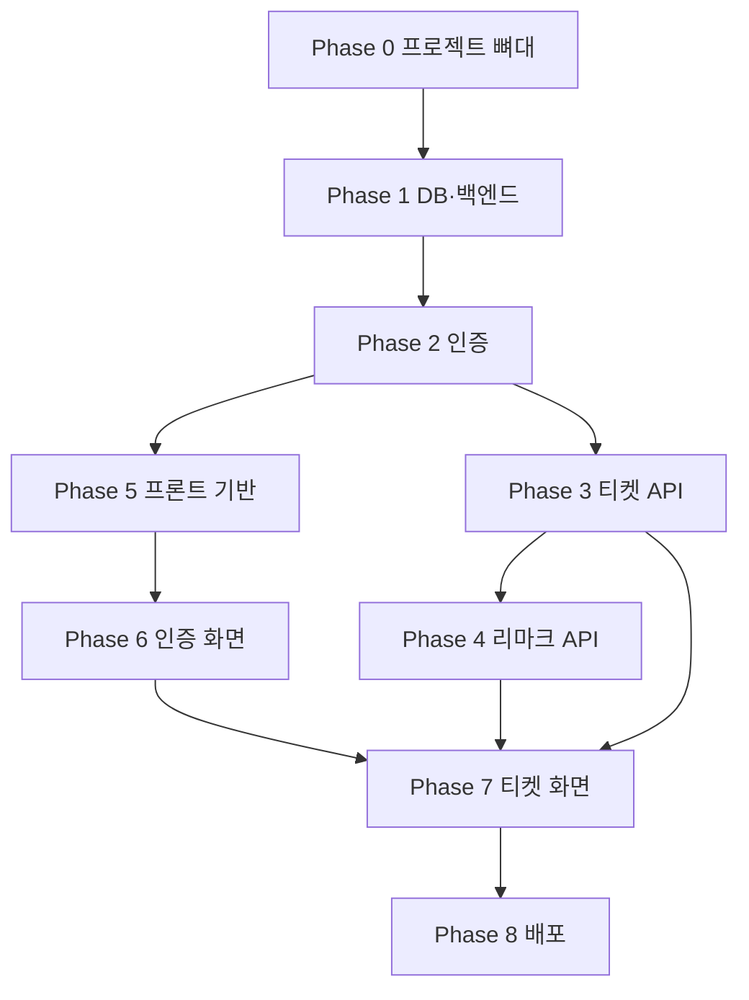
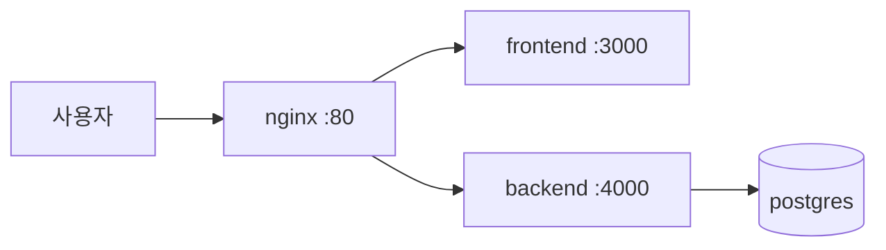

# Aditshoplog 프로젝트 기획서

## 1. 프로젝트 개요

### 프로젝트명

Aditshoplog

### 프로젝트 설명

Aditshoplog는 구글시트로 관리하던 업무 티켓 처리 현황을 웹 기반으로 관리하기 위한 서비스입니다.

사용자는 회원가입 및 로그인 후 지라번호와 티켓명을 기준으로 업무 티켓을 등록할 수 있습니다.  
각 티켓에는 작성일자, 담당자, 배포일, repo별 브랜치 업로드 사항, 관련 파일 및 링크, 처리현황, dev merge 상태, 캡처 업로드 상태 등을 기록합니다.

기존 구글시트의 `리마크` 항목은 댓글 기능으로 분리하여, 티켓별 진행 메모를 시간순으로 남길 수 있도록 구성합니다.

---

## 2. 기술 스택

### Frontend

- Next.js
- React
- TypeScript
- CSS Modules

### Backend

- Node.js
- Express.js

### Database

- PostgreSQL

### Auth

- JWT (httpOnly Cookie)
- bcryptjs

### API Documentation

- Swagger

### Environment

- Docker
- Docker Compose

### Deployment

- **AWS Lightsail** (Ubuntu + Docker Compose)
- nginx 리버스 프록시 (80 → frontend/backend)
- GitHub Actions (CI + SSH 배포)

---

## 3. 서비스 주요 기능

### 인증 기능

- 회원가입
- 로그인
- 로그아웃 (`POST /api/auth/logout` — httpOnly Cookie 삭제)
- JWT 기반 인증 (httpOnly Cookie, JavaScript 접근 불가)
- 로그인 상태 유지
- 인증이 필요한 API 보호

### 티켓 관리 기능

- 티켓 등록
- 티켓 목록 조회
- 티켓 상세 조회
- 티켓 수정
- 티켓 삭제 (모든 로그인 사용자 가능, API 정책은 8절 참고)
- 티켓은 모든 로그인 사용자가 수정 가능. 단, 마지막으로 수정한 사람과 수정 시간을 로그로 남김

### 리마크 댓글 기능

- 티켓 상세 페이지에서 리마크 댓글 작성
- 리마크 댓글 조회
- 리마크 댓글 수정
- 리마크 댓글 삭제
- 본인이 작성한 리마크만 수정삭제 가능

### 페이징

- 티켓 목록 조회 시 페이징 처리
- page, limit 기반 서버 사이드 페이징

### 선택 기능

- 지라번호 검색
- 티켓명 검색
- 처리현황 필터
- 담당자 필터
- 배포일 필터

---

## 4. 화면 구성

### 페이지 목록

| 경로 | 설명 |
|------|------|
| `/` | 메인 또는 티켓 목록으로 redirect |
| `/login` | 로그인 페이지 |
| `/signup` | 회원가입 페이지 |
| `/tickets` | 티켓 목록 페이지 |
| `/tickets/new` | 티켓 등록 페이지 |
| `/tickets/[id]` | 티켓 상세 페이지 |
| `/tickets/[id]/edit` | 티켓 수정 페이지 |

---

## 5. 티켓 목록 화면

티켓 목록은 구글시트처럼 표 형태로 구성합니다.

### 목록 컬럼

- 작성일자
- 담당자
- 배포일
- 지라번호
- 티켓명
- 처리현황
- dev merge
- 캡처 업로드
- 수정삭제 버튼

### 목록 예시

 작성일자  담당자  배포일  지라번호  티켓명  처리현황  dev merge  캡처 업로드 
------------------------
 618  이현경  630  IT00368-8182  제도개선  개발 전달 완료  branch  완료 

---

## 6. 티켓 상세 화면

티켓 상세 페이지에서는 구글시트의 한 행에 해당하는 상세 정보를 보여줍니다.

### 상세 표시 항목

- 제목
- 작성일자
- 담당자
- 배포일
- 지라번호
- 티켓명
- aditshop repo 브랜치 업로드 사항
- newbqr repo 브랜치 업로드 사항
- 관련 파일 및 링크
- 처리현황
- dev merge 상태
- 캡처 업로드 상태
- 리마크 댓글 목록
- 리마크 댓글 작성 폼

### 제목 규칙

티켓 제목은 다음 형식으로 표시합니다.

```
지라번호 - 티켓명
```

예: `IT00368-8182 - 제도개선`

---

## 7. DB 스키마

### users 테이블

| 컬럼명 | 타입 | 설명 |
|--------|------|------|
| id | SERIAL PRIMARY KEY | 사용자 고유 ID |
| email | VARCHAR UNIQUE NOT NULL | 로그인 이메일 |
| password_hash | VARCHAR NOT NULL | bcrypt 해시 비밀번호 |
| name | VARCHAR NOT NULL | 표시 이름 |
| created_at | TIMESTAMP | 생성일 |
| updated_at | TIMESTAMP | 수정일 |

### tickets 테이블

| 컬럼명 | 타입 | 설명 |
|--------|------|------|
| id | SERIAL PRIMARY KEY | 티켓 고유 ID |
| title | VARCHAR NOT NULL | 지라번호 + 티켓명 |
| jira_key | VARCHAR NOT NULL | 지라번호 |
| ticket_name | VARCHAR NOT NULL | 티켓명 |
| writer_id | INTEGER NOT NULL | 최초 작성자 ID (FK → users.id) |
| assignee | VARCHAR | 담당자 |
| written_date | DATE | 작성일자 |
| deploy_date | DATE | 배포일 |
| aditshop_branch_note | TEXT | aditshop2.0 repo 브랜치 업로드 사항 |
| newbqr_branch_note | TEXT | newbqr repo 브랜치 업로드 사항 |
| related_links | TEXT | 관련 파일 및 링크 |
| status | VARCHAR | 처리현황 |
| dev_merge_status | VARCHAR | dev merge 상태 |
| capture_upload_status | VARCHAR | 캡처 업로드 상태 |
| last_modified_by | INTEGER | 마지막 수정자 ID (FK → users.id) |
| last_modified_at | TIMESTAMP | 마지막 수정 시간 |
| created_at | TIMESTAMP | 생성일 |
| updated_at | TIMESTAMP | 수정일 |

### remarks 테이블 (리마크 댓글)

| 컬럼명 | 타입 | 설명 |
|--------|------|------|
| id | SERIAL PRIMARY KEY | 댓글 고유 ID |
| ticket_id | INTEGER NOT NULL | 티켓 ID (FK → tickets.id) |
| author_id | INTEGER NOT NULL | 작성자 ID (FK → users.id) |
| content | TEXT NOT NULL | 댓글 내용 |
| created_at | TIMESTAMP | 생성일 |
| updated_at | TIMESTAMP | 수정일 |

## 8. API 정책

### 티켓 수정

PATCH /api/tickets/:id

Header:

Authorization: Bearer jwt-token

처리 내용:

- 로그인한 사용자만 수정 가능
- 작성자가 아니어도 수정 가능
- 수정 시 JWT에서 추출한 userId를 last_modified_by에 저장
- 수정 시 현재 시간을 last_modified_at에 저장
- updated_at도 현재 시간으로 갱신

즉, 티켓 수정 시 다음 값이 함께 업데이트됩니다.

- last_modified_by = 로그인한 사용자 ID
- last_modified_at = 현재 시간
- updated_at = 현재 시간

### 티켓 삭제

- DELETE /api/tickets/:id

Header:

Authorization: Bearer jwt-token

처리 내용:

- 로그인한 사용자만 삭제 가능
- 삭제는 모든 로그인 사용자 가능
- JWT의 userId와 tickets.writer_id를 비교
- 일치하지 않으면 403 Forbidden 반환

### 티켓 상세 응답 예시

{
  "id": 1,
  "title": "IT00368-8182 - 제도개선",
  "jira_key": "IT00368-8182",
  "ticket_name": "제도개선",
  "assignee": "이현경",
  "written_date": "2026-06-18",
  "deploy_date": "2026-06-30",
  "status": "개발 전달 완료",
  "dev_merge_status": "branch",
  "capture_upload_status": "완료",
  "writer_id": 1,
  "writer_name": "이현경",
  "last_modified_by": 2,
  "last_modified_by_name": "최유하",
  "last_modified_at": "2026-06-23T10:30:00.000Z",
  "created_at": "2026-06-18T09:00:00.000Z",
  "updated_at": "2026-06-23T10:30:00.000Z"
}

### 화면 표시 정책

티켓 상세 페이지 하단에 수정 로그를 표시합니다.

예시:

최초 작성자: 이현경
마지막 수정자: 최유하
마지막 수정일: 2026-06-23 10:30

티켓 목록에서도 필요하면 마지막 수정 정보를 간단히 표시할 수 있습니다.

최근 수정: 최유하 / 2026-06-23

---

## 9. 구현 순서 (권장)

아래 순서는 **백엔드 → 인증 → 핵심 CRUD → 프론트 → 배포** 흐름으로, 각 단계가 다음 단계의 기반이 되도록 구성했습니다.

### Phase 0 — 프로젝트 뼈대 (1~2일)

1. **저장소 구조 결정** — `frontend/`(Next.js), `backend/`(Express), 루트 `docker-compose.yml`
2. **환경 변수 템플릿** — `.env.example` (DB URL, JWT_SECRET, API URL 등)
3. **Docker Compose** — PostgreSQL 컨테이너만 먼저 기동해 DB 연결 확인
4. **공통 스크립트** — `npm run dev`로 프론트·백 동시 실행 (선택)

### Phase 1 — DB 및 백엔드 기반 (2~3일)

5. **DB 마이그레이션** — `users`, `tickets`, `remarks` 테이블 생성 (7절 스키마)
6. **Express 앱 골격** — 라우터, 에러 핸들러, CORS, JSON 파싱
7. **DB 연결 레이어** — pg 또는 ORM(Prisma/Drizzle 등) 선택 후 연결 테스트
8. **Swagger 설정** — `/api-docs` 경로, 이후 API 추가 시 문서 동기화

### Phase 2 — 인증 (2~3일)

9. **회원가입 API** — `POST /api/auth/signup` (bcrypt 해시 저장)
10. **로그인 API** — `POST /api/auth/login` (JWT 발급)
11. **인증 미들웨어** — httpOnly Cookie 또는 `Authorization: Bearer` 검증
12. **로그아웃** — `POST /api/auth/logout` (httpOnly Cookie 삭제)

> 이 단계까지 Postman/Swagger로 signup → login → 토큰으로 보호 API 호출을 검증합니다.

### Phase 3 — 티켓 API (3~4일)

13. **티켓 등록** — `POST /api/tickets` (title 자동 생성: `지라번호 - 티켓명`)
14. **티켓 목록** — `GET /api/tickets` (page, limit 페이징)
15. **티켓 상세** — `GET /api/tickets/:id` (writer_name, last_modified_by_name 포함)
16. **티켓 수정** — `PATCH /api/tickets/:id` (8절 정책: last_modified_by/at 갱신)
17. **티켓 삭제** — `DELETE /api/tickets/:id` (작성자만, 403 처리)
18. **검색·필터** — jira_key, ticket_name, status, assignee, deploy_date 쿼리 파라미터

### Phase 4 — 리마크 API (1~2일)

19. **댓글 목록** — `GET /api/tickets/:id/remarks`
20. **댓글 작성** — `POST /api/tickets/:id/remarks`
21. **댓글 수정·삭제** — `PATCH/DELETE /api/remarks/:id` (본인만)

### Phase 5 — 프론트엔드 기반 (1~2일)

22. **Next.js 프로젝트 생성** — TypeScript, CSS Modules, App Router
23. **API 클라이언트** — fetch 래퍼, `credentials: 'include'`, httpOnly Cookie, 401 시 `/login` redirect
24. **레이아웃·공통 UI** — 헤더, 로그인 상태 표시, 보호 라우트(HOC/middleware)

### Phase 6 — 인증 화면 (1~2일)

25. **`/login`, `/signup`** — 폼, 유효성 검사, 에러 메시지
26. **`/` redirect** — 로그인 시 `/tickets`, 미로그인 시 `/login`

### Phase 7 — 티켓 화면 (4~5일)

27. **`/tickets` 목록** — 표 UI, 페이징, 검색·필터, 수정/삭제 버튼
28. **`/tickets/new` 등록** — 전체 필드 입력 폼
29. **`/tickets/[id]` 상세** — 6절 항목 + 수정 로그 + 리마크 목록·작성
30. **`/tickets/[id]/edit` 수정** — PATCH 연동

### Phase 8 — 마무리 및 배포 (2~3일)

31. **Docker Compose 전체** — frontend, backend, postgres 한 번에 기동
32. **GitHub Actions CI** — lint, test, Docker build
33. **클라우드 배포** — 서버에 compose 또는 개별 배포, HTTPS, env 설정
34. **통합 테스트** — 회원가입 → 티켓 CRUD → 리마크 → 페이징·필터 시나리오

### 의존 관계 요약



### 병렬 작업 팁

- **Phase 3 진행 중** Phase 5(프론트 뼈대)를 병렬로 시작 가능
- **Swagger 문서**는 API 구현과 동시에 작성 (나중에 모으지 않기)
- **목록 UI**는 mock 데이터로 먼저 만들고, API 완성 후 연동해도 됨

### 구현 상태

| Phase | 상태 | 비고 |
|-------|------|------|
| 0 | 완료 | monorepo, docker-compose, .env.example |
| 1 | 완료 | 마이그레이션, Express, Swagger |
| 2 | 완료 | signup/login/me, JWT |
| 3 | 완료 | 티켓 CRUD, 페이징, 필터 |
| 4 | 완료 | 리마크 CRUD |
| 5 | 완료 | Next.js, API 클라이언트, Header |
| 6 | 완료 | login, signup, redirect |
| 7 | 완료 | tickets 목록·등록·상세·수정 |
| 8 | 진행 중 | AWS 배포 파일 추가, Lightsail 서버 생성·Secrets 설정 필요 |

---

## 10. AWS 배포 가이드

### 아키텍처



| 구성요소 | 설명 |
|---------|------|
| **AWS Lightsail** | Ubuntu 인스턴스 ($10~20/월) |
| **Docker Compose** | postgres + backend + frontend + nginx |
| **GitHub Actions** | `main` push 시 SSH로 자동 배포 |

### 1단계 — Lightsail 인스턴스 생성

1. [AWS Lightsail](https://lightsail.aws.amazon.com/) → **Create instance**
2. OS: **Ubuntu 22.04**, 플랜: **$10/월 (1GB RAM)** 이상
3. 네트워킹: HTTP(80) 포트 허용
4. SSH 키 다운로드 (`.pem`)

### 2단계 — 서버 초기 설정

```bash
ssh -i your-key.pem ubuntu@YOUR_SERVER_IP

git clone https://github.com/YOUR_ORG/aditshoplog.git ~/aditshoplog
cd ~/aditshoplog
chmod +x deploy/setup-server.sh deploy/deploy.sh
./deploy/setup-server.sh

# .env 편집 (비밀번호, JWT_SECRET, CORS_ORIGIN, APP_URL)
nano .env

./deploy/deploy.sh
```

`.env`는 `deploy/.env.production.example`을 참고합니다.  
`CORS_ORIGIN`, `APP_URL`은 `http://YOUR_SERVER_IP` 로 설정합니다.

### 3단계 — GitHub Actions Secrets

Repository → Settings → Secrets → Actions:

| Secret | 값 |
|--------|-----|
| `AWS_HOST` | Lightsail 퍼블릭 IP |
| `AWS_USER` | `ubuntu` |
| `AWS_SSH_KEY` | SSH private key 전체 내용 |
| `AWS_APP_DIR` | `/home/ubuntu/aditshoplog` (선택) |

`main` 브랜치 push 시 `.github/workflows/deploy-aws.yml`이 자동 배포합니다.

### 4단계 — HTTPS (선택)

도메인 연결 후 Certbot 또는 Lightsail Load Balancer + SSL 인증서 적용.  
nginx `443` 설정 추가 필요.

### 로컬 프로덕션 테스트

```bash
cp deploy/.env.production.example .env
# .env 값 수정 후
npm run prod:up
```

- 접속: http://localhost
- Swagger: http://localhost/api-docs

### 향후 확장 (선택)

- DB를 **Amazon RDS PostgreSQL**로 분리
- 이미지를 **Amazon ECR**에 push 후 EC2에서 pull
- 로그·모니터링: **CloudWatch**

> 구현 진행 시 위 표의 상태·비고를 이 문서에 계속 갱신합니다.